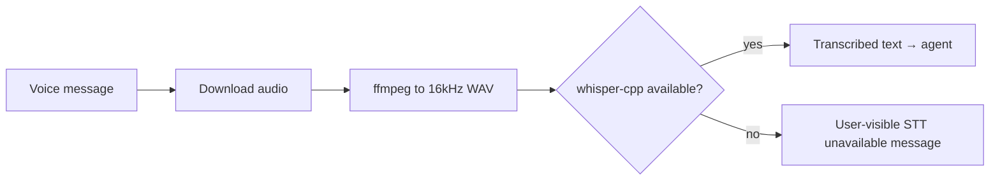

# Telegram agent-complete parity requirements

## Summary

Upgrade Heypi's Telegram adapter from an agent-focused long-poll integration toward Telegram agent parity across P0–P3: security and formatting fixes, local voice transcription via whisper.cpp (TypeScript orchestration, no cloud STT), richer outbound delivery, notification-grade scheduled send, optional webhook ingress, built-in group automation, and polls/location — all exposed through expanded `telegram()` configuration with long polling remaining the default deployment path. Inline query mode (`@bot` search in other chats) is out of scope for this initiative.

## Problem frame

The prior Telegram audit compared Heypi's adapter (`packages/heypi/src/io/telegram.ts`) against a general Telegram bot skill covering setup, multimodal handlers, notification templates, group automation, and inline mode. Heypi already exceeds the skill on agent-native concerns — approvals, scoped memory, streaming, delivery retries, forum topics, and cross-adapter alignment — but gaps remain on classic bot product surfaces: voice, parse mode, callback allow enforcement, scheduled attachments, webhook deployment, group moderation, and polls.

Operators building Telegram agents on Heypi should not need a separate bot framework for voice notes, alert digests, welcome flows, or interactive keyboards. The initiative treats P0–P3 as one coherent framework upgrade, not a series of unrelated patches.

## Key decisions

- **Agent-complete parity in framework** — P0–P3 capabilities ship as first-class `telegram()` config and behavior for agent use cases, not primarily as example-only middleware. Not literal Bot API completeness (see non-goals).
- **Long-poll primary** — long polling remains the default and documented happy path; webhook mode is optional for advanced self-hosted HTTPS setups on the shared HTTP listener.
- **Local whisper.cpp STT (TypeScript)** — voice transcription uses whisper.cpp + ffmpeg on the host only; implemented in TypeScript within `@hunvreus/heypi`. No cloud STT providers (Groq, OpenAI, etc.) in this initiative.
- **Full adapter group automation** — welcome on join, flood control, and link/spam filtering live in adapter config, not only in examples.
- **Safe defaults for group automation** — welcome, flood control, link/spam filtering, and related features are opt-in and off by default so existing bots do not change behavior on upgrade.
- **Poll support in adapter** — poll creation (R20) is a separate P3 parity surface, not part of moderation automation.
- **Unified public API** — one `telegram()` entrypoint; internal modules may split implementation without fragmenting the developer surface.
- **Phased delivery within one initiative** — P0/P1 land before P2/P3 in implementation order, but the requirements doc covers the agent-complete parity target so planning can slice PRs without dropping scope.

## Requirements

**P0 — correctness and security**

- R1. Callback and interactive-button handlers (Telegram callback queries, Slack actions, Discord button interactions) enforce the same `allow` dimensions as inbound messages (`chats`/`channels`, `users`, `dms`) against the interacting actor and the message's chat context; disallowed actors receive a clear acknowledgment and no agent invocation. The allow check runs before handler invocation, message edits, or approval state transitions. Approval prompts in shared channels MUST NOT expose actionable approval identifiers, pending command details, or other sensitive approval metadata to actors outside the configured allow dimensions; deliver full approval UI to allowlisted approvers only (for example via DM), or use a redacted group-visible summary with no approval-id or command leak.
- R2. Outbound Telegram messages support configurable parse mode (`MarkdownV2`, `HTML`, or plain) with safe escaping so approval titles, agent markdown, and scheduler notifications render as intended instead of literal asterisks.
- R3. When parse mode is enabled, long-message chunking preserves valid markup boundaries or degrades gracefully to plain text rather than sending broken partial markup.

**P1 — high user value**

- R4. Voice messages and audio attachments are downloaded and transcribed through local whisper.cpp before agent invocation; transcribed text becomes the inbound message text with the original audio retained as an attachment when the attachment store is configured. STT MUST NOT block processing of other Telegram updates (callbacks, messages, member events) on the long-poll loop — transcription runs concurrently or via a bounded background queue so the adapter remains responsive during slow local CLI work.
- R5. STT is local-only via whisper.cpp — no API keys, no cloud fallback. Implementation is TypeScript-only in the Heypi package. Requirements:
  - **Audio prep:** Telegram voice/audio arrives as OGG/Opus (and other formats per Bot API). The TS layer MUST normalize to whisper-compatible input (typically 16 kHz mono WAV) via `ffmpeg` `execFile` before transcription — document `ffmpeg` as a host prerequisite alongside whisper.cpp.
  - **Local engine:** `whisper-cpp` / `whisper-cli` (ggml-org/whisper.cpp) discovered on `PATH` plus `/opt/homebrew/bin` and `/usr/local/bin`. Invoke via Node `execFile` with fixed argv (`-m`, `-f`, `-l`, `--output-txt` / `-of`); no Python `whisper` CLI as the default. Model file path comes from config/env (default `ggml-base.en.bin`); Heypi does not bundle weights.
  - **Custom command escape hatch:** optional `HEYPI_LOCAL_STT_COMMAND` (Hermes-compatible alias: `HERMES_LOCAL_STT_COMMAND`) using fixed placeholders only (`{input_path}`, `{output_dir}`, `{output_path}`, `{language}`, `{model}`, `{format}`); placeholders are shell-quoted at substitution time; Telegram user/chat fields MUST NOT be interpolated into the command template.
  - **Command execution safety:** temp output directory per transcription, max audio size 25 MB, bounded timeout (default 300s) with process-tree termination on expiry, no embedding of inbound message text or actor metadata in the command.
  - **Unavailable local STT:** when whisper.cpp, ffmpeg, or the model file is missing, respond with a concise user-visible message (AE4); do not invoke the agent with empty text and do not call cloud APIs.
- R6. Photo-only inbound messages (no text) produce agent-visible context indicating an image was received; photos continue to flow through the existing attachment pipeline for vision-capable agents.
- R7. Outbound image attachments use photo delivery when the attachment is an image; non-image files continue to use document delivery.
- R8. Scheduled `adapter.send()` to Telegram delivers attachments, not only text chunks.
- R9. CLI adds `telegram setup-commands` to register BotFather command menus from a config file or built-in defaults.
- R10. CLI `telegram observe` prints chat ID, user ID, and copy-paste snippets for both `allow.chats` and `allow.users`.

**Voice STT flow (local whisper.cpp only)**

**P2 — product expansion**

- R11. Optional webhook ingress mode registers Telegram updates on the shared Heypi HTTP listener; long-poll mode remains available and is the default. Webhook mode MUST validate `X-Telegram-Bot-Api-Secret-Token` against a configured secret on every inbound update POST and reject requests with a missing or mismatched token before handling updates.
- R12. `Outbound` supports optional reply markup so agents and scheduler jobs can send custom inline keyboards beyond built-in approval/progress buttons.
- R13. Namespaced custom callback data routes to the agent as structured inbound events with the same allow enforcement as R1.
- R14. `my_chat_member` / `chat_member` updates optionally trigger configurable welcome messages when the bot is added to a group.
- R15. Per-user flood control limits how often a single actor can trigger the agent within a configurable window; excess events are dropped with debug logging.
- R16. Optional link filtering rejects or drops messages containing URLs outside a configured allowlist before agent invocation.
- R17. Optional spam heuristics (repeated identical text, excessive mention density, or configurable rate within a chat) can drop messages before agent invocation.
- R18. Edited messages are optionally re-processed as updates to the same thread with configurable behavior (ignore, re-run agent, or log-only).

**P3 — advanced parity**

- R20. Poll support allows creating Telegram polls via adapter config or an agent-facing tool wrapping `sendPoll`.
- R21. Location messages pass structured coordinates in inbound context for location-aware agent tools.
- R22. Unsupported message types (sticker-only, empty content) receive a concise user-visible reply instead of silent drops when the message would otherwise have triggered the agent.
- R23. New `examples/telegram-alerts` demonstrates severity-based notification templates routing through the Heypi **HTTP/webhook input adapter** (ingress for external events) to Telegram scheduled send targets — not Telegram Bot API webhook mode (R11).
- R24. Existing examples (`examples/telegram-workout`, `examples/telegram-cofounder`) adopt relevant P1 features (parse mode, voice where appropriate, BotFather commands) without changing their product purpose.

**Documentation and operator experience**

- R25. Adapter docs (`packages/heypi/docs/adapters/telegram.md`) cover all new config options, STT setup, webhook vs poll deployment, group automation defaults, and BotFather checklist (`/setprivacy`, `/setcommands`, group privacy implications).
- R26. Environment variables for local STT (model path, optional custom command) and Telegram webhook secrets (including the webhook secret token) are declared in root `.env.schema` when the adapter reads them directly.
- R27. Root `CHANGELOG.md` records the Telegram agent-complete parity upgrade under `[Unreleased]` as capabilities land.

## Actors

- A1. **Operator** — configures `telegram()`, BotFather, allowlists, local STT (whisper.cpp + model path), and group automation; runs CLI setup/observe commands.
- A2. **End user** — sends messages, voice notes, photos, and locations; clicks inline keyboard buttons; joins groups where the bot is present.
- A3. **Heypi agent** — receives normalized inbound events with text, attachments, and structured context; returns outbound text, attachments, approvals, and optional reply markup.
- A4. **Scheduler** — sends proactive notifications and digests to Telegram targets via `adapter.send()`.

## Key flows

- F1. **Voice note to agent reply**
  - **Trigger:** A2 sends a voice message in an allowed chat.
  - **Actors:** A1, A2, A3
  - **Steps:** Adapter downloads audio → ffmpeg normalize → whisper.cpp (R4, R5) → transcribed text enters normal gate/trigger/allow path → agent runs → outbound uses parse mode and chunking (R2, R3) → optional photo/document attachments (R7).
  - **Covered by:** R2–R5, R7

- F2. **Approval callback from non-allowlisted user**
  - **Trigger:** A2 clicks Approve on a message in a group where they are not in `allow.users` (Telegram, Slack, or Discord).
  - **Actors:** A2, A3
  - **Steps:** If approval UI is group-visible, non-allowlisted actors see only a redacted summary (R1) → callback arrives → allow check fails (R1) → callback answered with denial → agent not invoked.
  - **Covered by:** R1

- F3. **Bot added to group with welcome enabled**
  - **Trigger:** Bot is added to a group (membership change affecting the bot).
  - **Actors:** A1, A2
  - **Steps:** `my_chat_member` or relevant `chat_member` update received → welcome template sent if configured (R14) → no agent invocation unless a separate message triggers it.
  - **Covered by:** R14

- F4. **Scheduled alert digest**
  - **Trigger:** Scheduler job fires for a Telegram target.
  - **Actors:** A4, A2
  - **Steps:** Job produces outbound text (and optional attachment) → `adapter.send()` delivers with parse mode and attachments (R2, R8) → user receives formatted digest in chat.
  - **Covered by:** R2, R8

- F5. **Webhook mode production deploy**
  - **Trigger:** A1 enables webhook mode and exposes the shared HTTP listener over HTTPS.
  - **Actors:** A1
  - **Steps:** Adapter registers webhook URL and secret token with Telegram → updates arrive via HTTP POST → secret header validated → same handle path as long poll → long poll is not active concurrently for the same token.
  - **Covered by:** R11

## Acceptance examples

- AE1. **Callback allow enforcement and approval visibility**
  - **Covers:** R1
  - **Given:** `allow.users: ["111"]` and a pending approval in a group where user `222` is present
  - **When:** User `222` views the group and taps Approve
  - **Then:** User `222` does not see actionable approval identifiers or sensitive pending-command details in the group message; callback is answered with a denial; agent handler is not called; approval state unchanged

- AE2. **Approval markdown renders**
  - **Covers:** R2
  - **Given:** `parseMode: "MarkdownV2"` and an outbound approval with title "Approval required"
  - **When:** The approval message is sent
  - **Then:** The title appears bold in Telegram clients, not as literal `*Approval required*`

- AE3. **Voice note with local whisper.cpp**
  - **Covers:** R4, R5
  - **Given:** `ffmpeg`, `whisper-cpp`, and `ggml-base.en.bin` installed; `stt.local.modelPath` configured
  - **When:** A2 sends a short voice note saying "status report"
  - **Then:** Agent receives inbound text containing the transcription; reply is sent normally

- AE4. **STT unavailable graceful failure**
  - **Covers:** R5
  - **Given:** `whisper-cpp`, `ffmpeg`, or the ggml model is missing on the host
  - **When:** A2 sends a voice note
  - **Then:** User receives a concise message that voice transcription is unavailable; agent is not invoked with empty text

- AE5. **Scheduled send with attachment**
  - **Covers:** R8
  - **Given:** A scheduler job targeting a Telegram chat with a text summary and one image attachment
  - **When:** The job runs
  - **Then:** User receives the text and the image (as photo per R7); no `scheduled_attachments_unsupported` warning

- AE6. **Group automation off by default**
  - **Covers:** R14, R15, R16, R17
  - **Given:** Existing bot config with no group automation keys set
  - **When:** Upgrade to the parity release
  - **Then:** Behavior matches pre-upgrade for message handling; no welcome, flood, link, or spam filtering unless explicitly enabled

## Success criteria

**Initiative complete (v1)** — all of the following:

- P0 requirements (R1–R3) implemented with automated tests in `packages/heypi/tests/`.
- P1 requirements (R4–R10) implemented; voice STT works via whisper.cpp + ffmpeg in a documented local smoke scenario; AE3–AE5 satisfied.
- Existing Telegram tests (`packages/heypi/tests/telegram.test.ts`, `packages/heypi/tests/adapter-filter.test.ts`) continue to pass; new behavior adds coverage rather than regressing allow/trigger/chunk semantics.
- `pnpm run check`, `pnpm run typecheck`, and `pnpm --filter @hunvreus/heypi run test` pass for the shipped phase.
- Adapter docs and `.env.schema` are updated in the same PRs as the behavior they describe.

**Explicit non-goals for v1** (documented, not gated): inline query mode; cloud STT; Telegram payments/games; TTS replies; n8n-style workflow builders.

**P2 milestone** (optional follow-on within the same initiative, not required for v1 complete):

- R11–R18 implemented with smoke coverage for webhook secret validation (R11), custom callbacks (R12–R13), and group automation opt-in defaults (AE6).

**P3 milestone** (optional follow-on within the same initiative, not required for v1 complete):

- R20–R24 implemented; `examples/telegram-alerts` runnable when R23 ships.

## Scope boundaries

**Deferred for later (within Heypi, not this initiative)**

- Telegram-native payments, games, and Web App launch buttons beyond basic URL inline buttons.
- Inline query mode (`@bot` search suggestions in other chats).
- Cloud STT providers (Groq, OpenAI, and other hosted transcription APIs).
- Built-in n8n or visual workflow integration.
- Automatic BotFather profile editing (`/setdescription`, `/setuserpic`) beyond command registration CLI.
- TTS voice replies (Hermes voice-mode outbound audio) — inbound STT only for this initiative unless cost is trivial.

**Outside this product's identity**

- A standalone hosted notification SaaS or multi-tenant alert router.
- Python runtime, `faster-whisper`, or other Python ML stacks as STT dependencies — local transcription uses whisper.cpp + ffmpeg only.
- Replacing Heypi's agent model with fixed command handlers for `/start`, `/help`, etc. — commands may be documented and registrable, but free-form agent chat remains the primary interaction model.

## Dependencies and assumptions

- Hermes `HERMES_LOCAL_STT_COMMAND` placeholder semantics are a reference for the custom-command escape hatch only — Heypi does not adopt Hermes cloud STT providers.
- Operators MUST install host prerequisites for voice: `ffmpeg`, `whisper-cpp` or `whisper-cli`, and a downloaded ggml model (see STT implementation research). Heypi documents prerequisites rather than bundling weights.
- Deployments without whisper.cpp + ffmpeg + model on the host cannot transcribe voice; document AE4 behavior and setup steps rather than cloud fallbacks.
- Telegram Bot API limits (4096 text, 200 callback_data, rate limits) remain enforced with existing chunking and truncation patterns extended as needed.
- Webhook mode assumes the operator can expose the Heypi HTTP listener over HTTPS with a valid certificate or reverse proxy.
- Group automation features require the bot to receive the relevant update types (`my_chat_member`, etc.); docs must state BotFather and group permission prerequisites.

## STT implementation research (TypeScript, local only)

Research target: local whisper.cpp STT without Python or cloud APIs.

### Heypi decision (locked)

| Topic | Choice |
| --- | --- |
| Engine | **whisper.cpp** (`whisper-cpp` / `whisper-cli`) |
| Orchestration | TypeScript in `@hunvreus/heypi` |
| Audio prep | **ffmpeg** (OGG/Opus → 16 kHz WAV) |
| Cloud STT | **Out of scope** — no Groq, OpenAI, or other hosted transcription |
| Python whisper | Opt-in via `HEYPI_LOCAL_STT_COMMAND` only |

### What Hermes does (reference only — not copied for cloud)

Hermes uses in-process `faster-whisper`, Python `whisper` CLI, then Groq/OpenAI. Heypi takes only the **custom-command placeholder** pattern from Hermes, not its provider chain.

Hermes checks `/opt/homebrew/bin` and `/usr/local/bin` before `PATH` — Heypi uses the same discovery dirs for whisper.cpp binaries.

### Telegram-specific constraint

Voice messages download as **OGG/Opus**. whisper.cpp expects **WAV** (16 kHz). Fixed argv: `ffmpeg -i input.ogg -ar 16000 -ac 1 output.wav` then whisper-cpp.

### Binary discovery order (resolves D1)

1. `HEYPI_LOCAL_STT_COMMAND` or `HERMES_LOCAL_STT_COMMAND` if set
2. `whisper-cpp` in `/opt/homebrew/bin`, `/usr/local/bin`, then `PATH`
3. `whisper-cli` in the same dirs
4. If none, or model/ffmpeg missing → AE4 user-visible failure

### Default local argv (whisper-cpp)

`whisper-cpp -m {model_path} -f {wav_path} -l {language} --output-txt -of {output_base}`

Model path from `stt.local.modelPath` or env `HEYPI_STT_MODEL_PATH`.

### Deployment matrix

| Environment | Voice STT |
| --- | --- |
| macOS dev | `brew install whisper-cpp ffmpeg` + `ggml-base.en.bin` → AE3 |
| Linux bare metal | whisper.cpp + ffmpeg + model → AE3 |
| Docker / minimal image | No voice unless image/docs add ffmpeg + whisper-cpp + model; else AE4 |

Heypi runtime Docker images do **not** ship whisper today.

### Config / env (for planning)

| Key | Purpose |
| --- | --- |
| `stt.enabled` | Opt-in voice transcription (default off or on — decide in implementation) |
| `stt.local.binary` | Override whisper binary path |
| `stt.local.modelPath` | Path to `ggml-*.bin` (**required** for local STT) |
| `stt.local.language` | Default `en` |
| `HEYPI_STT_MODEL_PATH` | Env alias for model path |
| `HEYPI_LOCAL_STT_COMMAND` | Optional custom template (Hermes alias supported) |

### Deferred (not this initiative)

- Groq, OpenAI, and all cloud transcription APIs
- In-process `@huggingface/transformers` (pure TS, no CLI)
- xAI / Mistral / ElevenLabs STT

## Outstanding questions

**Deferred to planning**

- D1. ~~Exact STT env var names and config shape~~ — resolved: local whisper.cpp only; `stt.local.modelPath` / `HEYPI_STT_MODEL_PATH`, optional `HEYPI_LOCAL_STT_COMMAND`; finalize in `.env.schema` during implementation.
- D2. ~~Inline query sync vs static catalog~~ — resolved out of scope; inline query mode is not part of this initiative.
- D3. Spam heuristic defaults and whether dropped messages should ever notify moderators vs silent debug-only drops.
- D4. PR slicing order within the initiative — suggested: P0 → P1 (voice + outbound) → P2 (webhook + group) → P3 (polls + alert example), but planning may parallelize independent modules.
- D5. STT concurrency model — queue vs in-process worker vs per-update async task; resolved during planning against R4 non-blocking requirement.

## Sources

- Prior audit in conversation (2026-06-07): P0–P3 gap list against telegram-bot skill.
- Heypi Telegram adapter: `packages/heypi/src/io/telegram.ts`
- Heypi Telegram docs: `packages/heypi/docs/adapters/telegram.md`
- Hermes Agent STT semantics (reference only): `tools/transcription_tools.py` — provider chain, `HERMES_LOCAL_STT_COMMAND`, placeholder quoting, 25 MB limit, command timeouts
- whisper.cpp: https://github.com/ggml-org/whisper.cpp (CLI `whisper-cpp` / `whisper-cli`, Docker `ghcr.io/ggml-org/whisper.cpp`)
- Homebrew `whisper-cpp` formula; Simon Willison TIL for macOS usage
- Existing examples: `examples/telegram-workout/`, `examples/telegram-cofounder/`
