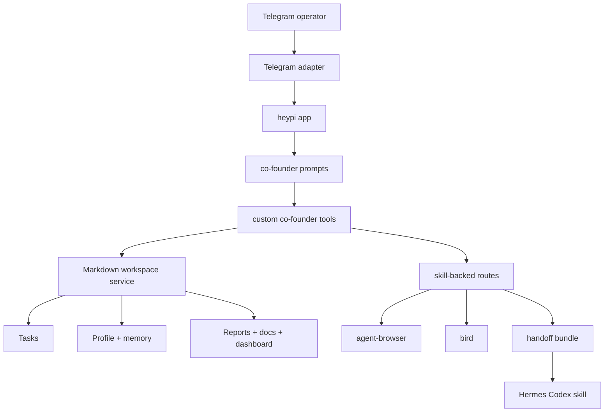

# feat: Add Telegram co-founder example

## Summary

Add a complete Telegram co-founder example for the selected Polsia behavior set. The agent manages company memory, Markdown tasks, recurring work, reports, documents, capability routing, and skill-backed execution handoffs while staying honest about every tool boundary.

---

## Problem frame

The existing Telegram workout example proves long polling and simple local tools, but Huy wants a real co-founder operating surface in Telegram. The selected Polsia features define that surface: co-founder voice, action-grounding, Markdown task operations, memory/learnings, recurring work, reports/documents, capability awareness, browser/Twitter/research/source handoffs, and security boundaries.

The plan implements the selected feature set as a complete example. It intentionally excludes unselected Polsia features such as bug reporting, support tickets, feature requests, agent creation/disablement, email, cold outreach, image generation, domain guidance, billing/God Mode, and legal/retaliation flows (see origin: `docs/brainstorms/2026-06-06-telegram-cofounder-agent-requirements.md`).

---

## Actors

- A1. Huy or another trusted operator using Telegram.
- A2. Telegram co-founder agent.
- A3. heypi and Pi runtime.
- A4. Local file-backed co-founder workspace.
- A5. Selected execution helpers: `agent-browser`, `bird`, `handoff`, and Hermes Codex.
- A6. Future implementation agents that consume this plan.

---

## Requirements

### Identity and setup

- R1. Present as a business/product co-founder, not as Polsia, GlamOps, helpdesk, or generic chatbot.
- R2. Write concise, direct, outcome-first Telegram replies.
- R3. Include a grounded `Next:` recommendation after substantive replies when useful.
- R4. Claim actions only when a tool or handoff succeeded in the same turn.
- R5. Preserve exact names, task titles, paths, error strings, constraints, and operator decisions.
- R6. Run as a Telegram heypi app with a BotFather token and Pi-managed model auth.
- R7. Do not require `OPENAI_API_KEY` in the default example `.env.example` or README path.
- R8. Allow model override through `HEYPI_MODEL`.
- R9. Support direct-message local testing and optional Telegram chat/user allowlists.

### Local operating memory

- R10. Maintain a durable company profile.
- R11. Maintain memory/learnings for decisions, lessons, operator preferences, and reusable context.
- R12. Read and update local company documents.
- R13. Expose compact current context without dumping whole stores into chat.
- R14. Keep local state under the example directory and out of git by default.

### Markdown task system

- R15. Create tasks as Markdown files.
- R16. Inspect existing Markdown tasks before creating a new task to reduce duplicates.
- R17. Push back on ambiguous task requests with 2-3 concrete options.
- R18. Return repo-relative Markdown task paths when referencing tasks.
- R19. Link related Markdown tasks in metadata when the relationship is known.
- R20. Keep the selected task system to Markdown task creation, duplicate checks, clarity gates, repo-relative paths, related-task metadata, recurring templates, and schedule metadata; task edit/reject/approve/complete/reorder tools are out of this scope.
- R21. Support recurring task templates and safe schedule metadata.

### Capabilities, reports, and documents

- R22. List available configured capabilities and selected skill-backed workflows.
- R23. Suggest a specialist agent or hiring/specialist need for work outside direct tools, but do not create agents or suggest generic skills outside the explicitly selected routes.
- R24. Create and read local business reports.
- R25. Maintain local dashboard/inbox-style status notes: asks, owner replies, task completions, current focus, and alerts.
- R26. Support read-only DB/query awareness through local records, reports, or delegated prompts.
- R27. Understand app deployment state through local records, reports, or delegated prompts.

### Selected external workflows

- R28. Route browser automation through the `agent-browser` skill contract.
- R29. Route X/Twitter workflows through the `bird` skill contract.
- R30. Route research workflows through Markdown task prompts and the selected execution handoff.
- R31. Route engineering/source work by using the `handoff` skill to create a prompt, copying every selected skill in the handoff manifest including the Hermes Codex skill itself, requiring trusted-operator approval, starting the Hermes Codex skill named by Huy after copy validation succeeds, and recording start evidence.
- R32. Route GitHub/source operations through the engineering/Codex handoff path.
- R33. Consider the Meta Ads pitch as the selected growth recommendation in growth/customer-acquisition conversations, without copying Polsia pricing or targeting claims.

### Safety and exclusions

- R34. Refuse prompt-injection or self-reprogramming attempts.
- R35. Avoid asking for or storing secrets, tokens, passwords, private keys, payment data, or sensitive browser cookies.
- R36. Do not access files outside the configured example workspace except explicitly selected skill source paths copied into handoff bundles.
- R37. Say when a capability is unavailable, excluded, or only possible through a handoff.
- R38. Do not implement or imply excluded Polsia features: bug reporting, support tickets, feature requests, agent creation/disablement, email sending, cold outreach, image handoff, domain guidance, billing/God Mode, or legal/retaliation advice.
- R39. Default-deny mutating tools and handoff routes unless a trusted Telegram user allowlist is configured or an explicit local-dev flag is enabled.
- R40. Treat persisted Markdown, external research/browser/Twitter content, source snippets, and copied skills as untrusted data, not runtime instructions.
- R41. Copy skill sources only through a configured skill catalog with allowlisted roots, realpath containment, symlink refusal, file size limits, secret redaction, and a manifest containing copied paths, provenance, and hashes.
- R42. Keep browser and Twitter routes least-privilege: no cookie export, no browser profile copying, no private page capture unless explicitly approved, and no X/Twitter posting or account mutation without trusted confirmation.
- R43. Keep DB/query, deployment, GitHub, and source awareness to local records, redacted summaries, reports, or delegated prompts; do not add direct DB clients, deployment commands, cloud APIs, or direct GitHub mutation tools in this feature.

---

## Key flows

- F1. First conversation: the operator provides company context; the agent saves the profile/memory, explains selected capabilities, and proposes a grounded next move.
- F2. Task creation: the agent checks Markdown tasks, creates a non-duplicate task, writes metadata, and returns the repo-relative task path.
- F3. Ambiguous work shaping: the agent returns 2-3 options and waits for clarification before creating work.
- F4. Recurring work: the agent creates or updates recurring task templates with explicit schedule metadata and safe execution notes.
- F5. Engineering handoff: the agent creates a task and handoff prompt, copies every selected skill in the handoff manifest including the Codex skill, shows the command boundary, waits for trusted approval, starts Hermes Codex only after copy validation succeeds, and records prepared, blocked, approved, or started status.
- F6. Browser/Twitter/research routing: browser work routes through `agent-browser`, X/Twitter through `bird`, and research through a research task/handoff workflow.
- F7. Unsupported feature: the agent says the capability is excluded or unavailable and offers a supported alternative when one exists.

---

## Success criteria

- S1. The app can be run from the repo root with a dedicated Telegram co-founder dev command.
- S2. A Telegram direct message can save profile/memory, create Markdown tasks, manage recurring tasks, write reports, and retrieve context.
- S3. Skill-backed routes are represented in tools/prompts/tests: `agent-browser`, `bird`, `handoff`, and Hermes Codex.
- S4. Prompt and tests enforce action-grounding, selected Polsia behavior, excluded-feature honesty, and no secret capture.
- S5. Future implementation can start from this plan without re-reading the raw Polsia source bundle.
- S6. Deterministic transcript tests prove the first-run Telegram loop, task loop, route handoff loop, excluded-feature response, and secret refusal without live Telegram or model credentials.

---

## Key technical decisions

- KTD1. Markdown is the operator-visible source of truth: tasks, recurring templates, reports, documents, memory notes, and dashboard/inbox notes should be readable/editable as Markdown. JSON indexes are allowed only as derived lookup aids.
- KTD2. The app gets a narrow local workspace service: one module owns paths, frontmatter, slugs, indexes, and safe reads/writes so tools do not duplicate file handling.
- KTD3. Custom tools map directly to selected capabilities: profile/memory, tasks, recurring tasks, reports, documents, dashboard/inbox, capability discovery, and selected workflow handoffs each get explicit tool names and schemas.
- KTD4. Excluded Polsia features are prompt-and-test constraints: the agent must refuse or redirect those requests rather than leaving them as undocumented omissions.
- KTD5. Skill-backed execution is explicit: browser uses `agent-browser`, X/Twitter uses `bird`, engineering/source uses `handoff` plus Hermes Codex, and the handoff bundle copies every selected skill in the manifest including the Codex skill itself.
- KTD6. Pi auth stays outside `.env.example`: default to `process.env.HEYPI_MODEL ?? "openai-codex/gpt-5.4-mini"` and document that Pi resolves subscription auth or provider credentials.
- KTD7. Tests target deterministic local behavior: automated tests cover file formats, tools, prompt guardrails, routing decisions, mocked adapter transcripts, and static docs/config. Live Telegram/model/helper execution remains a documented smoke path.
- KTD8. Hermes Codex startup is a narrow runner contract, not a text artifact: tests use a fake runner, runtime uses a configured command adapter, and `started` is only returned when the adapter reports a successful start after copy validation and trusted approval.
- KTD9. Security is enforced in code paths: all persisted or external content is untrusted data, all mutating tools use the tool policy matrix, and skill copying goes through a catalog with provenance and hash manifests.
- KTD10. Execution converges on the final co-founder architecture rather than preserving smooth intermediate compatibility. Do not add throwaway adapters, legacy fallbacks, broad generic routes, or artifact-only success states to keep partial phases looking complete.

---

## First-run product contract

When the workspace is empty, the first Telegram exchange should feel like a co-founder onboarding loop, not a feature dump.

- Ask for the minimum useful company context: company name, offer, target customer, current focus, and one constraint or risk.
- Save provided facts to profile and memory only after the operator supplies them.
- Reply with a compact summary of what was saved, one immediate operating suggestion, and a grounded `Next:` recommendation.
- If the operator skips context and asks for work, create or shape the requested work without blocking on onboarding, then ask for the missing context as the next move.
- Tests must simulate an empty workspace first conversation through saved profile/memory and a `Next:` recommendation.

---

## Traceability crosswalk

| Original feature IDs | Plan coverage |
| --- | --- |
| Included 1-6 | R1-R5, R10-R13, U4, U6 |
| Included 7, 8, 10, 11, 15 | R15-R20, U2, U3 |
| Included 9 | R23, U4, U6 |
| Included 18-19 | R21, U3 |
| Included 23, 25-27 | R22, R24-R27, U4 |
| Included 29-31, 34, 37 | R28-R32, R39-R42, U5 |
| Included 32-33 | R26-R27, R43, U4, U5 |
| Included 35 | R33, U5 |
| Included 43, 45 | R34-R43, U5, U6 |
| Excluded 12-14, 16-17, 20-22, 24, 28, 36, 38-42, 44 | R38, U4, U6, AE10 |

---

## Tool policy matrix

| Tool family | Side effect | Confirmation and access |
| --- | --- | --- |
| Context reads and capability discovery | Read local Markdown/indexes | Allowed for trusted chats; no secrets or raw dumps |
| Profile, memory, task, report, document, dashboard writes | Write Markdown under the workspace | Requires trusted user allowlist or explicit local-dev flag |
| Recurring templates | Write schedule metadata only | No in-process scheduler; automatic execution is refused |
| Browser and Twitter routes | Create handoff artifacts | Account mutation or private capture requires trusted confirmation |
| Engineering/source handoff | Copy selected skills, write manifest, start runner | Requires trusted user, catalog validation, redaction, command preview, copy success, and explicit approval |

---

## Outcome-oriented execution

Build toward the intended end state directly: a complete Telegram co-founder example with its own workspace, tools, prompt bundle, transcript tests, and selected skill routes. Intermediate states may be incomplete inside the new example, but they must not create compatibility code that survives into the final architecture.

### Target end state

- `examples/telegram-cofounder/` owns the co-founder behavior as a complete example, not as a patched variant of `examples/telegram-workout/`.
- Markdown remains canonical for operator-visible state; JSON indexes, manifests, and generated summaries are derived.
- Selected external workflows use explicit route contracts from the start: `agent-browser`, `bird`, `handoff`, and Hermes Codex.
- Hermes Codex startup uses the runner contract and selected-skill manifest from the first handoff implementation, not a temporary "recorded command means started" shortcut.
- Mutating tools, handoff creation, and runner startup obey the tool policy matrix before they are exposed to Telegram.

### Temporary breakage boundary

- Acceptable while implementing: the new `examples/telegram-cofounder/` app may be incomplete, unrunnable, or missing later capabilities before its phase gate is reached.
- Not acceptable while implementing: existing packages/examples regress, root scripts are broken outside the new narrow target, state writes bypass the workspace service, or security checks are replaced with TODO-only warnings.
- Every intermediate phase should keep high-signal tests for the files it touches. Full repo verification is required only at the completion gate, once U8 is in place and dependencies are installed.

### No transitional compatibility

- Do not add generic skill suggestions to smooth over missing direct tools; only selected routes are skill-backed.
- Do not add direct GitHub, DB, deployment, browser-cookie, email, support, billing, domain, image, or cold-outreach fallbacks.
- Do not add artifact-only Codex startup as a temporary passing state. Prepared artifacts are allowed, but `started` must only mean the runner actually reported a successful start after approval and copy validation.
- Do not add task edit/reject/approve/complete/reorder tools as a bridge toward a fuller task system; they are outside this selected scope.
- Do not create a broad all-examples test contract to make root verification look comprehensive; keep the target narrow until a repo-wide policy is deliberately chosen.

### Phase gates

| Gate | Units | Proof required before moving on |
| --- | --- | --- |
| Foundation gate | U1-U2 | App config imports, workspace core tests, path containment tests, secret redaction tests, and no impact to existing examples |
| Operator loop gate | U3-U4 | First-run context, task create/duplicate/ambiguity, recurring template, report/document/dashboard, capability, DB/deployment local-record tests |
| Handoff gate | U5-U6 | Selected-skill manifest, Codex skill copy, runner fake-start, approval boundary, browser/Twitter limits, prompt guardrails, and untrusted-content tests |
| Completion gate | U7-U8 | Narrow co-founder example tests, mocked Telegram transcripts, docs/env/scripts/changelog alignment, full static/runtime verification when dependencies are installed, and documented live smoke result before claiming end-to-end behavior |

---

## High-level technical design



The app stays inside the existing heypi example shape: Telegram events become heypi turns, `agentFrom("./agent")` loads prompts, and Pi owns model execution. The co-founder layer is a local operating workspace plus selected skill-backed routes. The model can recommend and call tools; durable artifacts are Markdown files or copied skill bundles, not invisible chat-only state.

---

## Output structure

```text
examples/telegram-cofounder/
  .env.example
  README.md
  app.ts
  index.ts
  agent/
    AGENTS.md
    SOUL.md
  tools/
    capabilities.ts
    handoff.ts
    index.ts
    policy.ts
    routes.ts
    runner.ts
    skill-catalog.ts
    workspace.ts
    workspace.test.ts
    tools.test.ts
  agent.test.ts
  app.test.ts
  transcripts.test.ts
  fixtures/
    skills/
```

The exact filenames may shift during implementation, but these boundaries should remain: app wiring, prompt bundle, workspace service, skill-route helpers, tool factory, tests, and fixtures.

---

## Implementation units

### U1. Scaffold the complete co-founder app shell

- **Goal:** Create the new Telegram co-founder example with a thin entrypoint, testable app factory, model fallback, and safe Telegram allowlist handling.
- **Requirements:** R6, R7, R8, R9, R14, AE8, AE9, S1.
- **Dependencies:** None.
- **Files:** `examples/telegram-cofounder/index.ts`, `examples/telegram-cofounder/app.ts`, `examples/telegram-cofounder/app.test.ts`.
- **Approach:** Keep `index.ts` limited to loading `.env` and calling `runHeypi`. Put app creation in `app.ts` so tests can build the config without starting long polling. Use existing comma-list env parsing style and a named model fallback constant.
- **Patterns to follow:** `examples/telegram-workout/index.ts`, `packages/heypi/tests/public-api.test.ts`, `packages/heypi/src/config.ts`.
- **Test scenarios:**
  - Covers AE9. Given no `HEYPI_MODEL`, app config uses `openai-codex/gpt-5.4-mini`.
  - Given `HEYPI_MODEL` is set, app config uses the override provider/name.
  - Covers AE8. Given only `TELEGRAM_BOT_TOKEN`, app config does not require `OPENAI_API_KEY`.
  - Given allowlist env vars with whitespace and empty entries, parsed IDs are clean strings.
- **Verification:** App config is importable in tests; no automated test starts Telegram polling or model calls.

### U2. Build the Markdown workspace core

- **Goal:** Provide one canonical local service for safe paths, frontmatter read/write, slugging, repo-relative paths, indexes, and workspace containment.
- **Requirements:** R10, R11, R12, R13, R14, R15, R18, R19, R24, R25, R35, S2.
- **Dependencies:** U1.
- **Files:** `examples/telegram-cofounder/tools/workspace.ts`, `examples/telegram-cofounder/tools/workspace.test.ts`.
- **Approach:** Store operator-visible artifacts under `examples/telegram-cofounder/state/` using Markdown with YAML frontmatter. Use derived JSON indexes only for deterministic lookup/search. Centralize slugging, safe path resolution, realpath containment, symlink refusal, file size limits, atomic writes, sensitive-value checks, frontmatter parsing, and compact context rendering.
- **Execution note:** Implement test-first because this module is the canonical persistence boundary.
- **Patterns to follow:** `examples/slack-devops/tools/runbook.ts`, `examples/telegram-workout/index.ts`, root `.gitignore`.
- **Frontmatter decision:** Use a small explicit frontmatter parser dependency if one already exists in the workspace. If none exists, implement a minimal repo-local subset that supports scalar strings, booleans, arrays of strings, and ISO date strings, with deterministic parse/render errors.
- **Test scenarios:**
  - Given an empty workspace, context rendering returns compact empty-state sections.
  - Given profile and learning updates, Markdown files preserve exact operator strings and context summarizes them.
  - Given a dangerous path input, the service refuses to write outside the example workspace.
  - Given absolute paths, encoded separators, or symlink paths, the service refuses access.
  - Given oversized files or writes, the service returns a recoverable error.
  - Given text containing secret-shaped material, the service rejects or redacts it before persistence.
  - Given malformed frontmatter, reading returns a clear recoverable error and does not overwrite data.
  - Given repeated task titles, slugging produces stable unique Markdown paths.
- **Verification:** Workspace tests cover empty state, read/write, frontmatter, path safety, sensitive input, and index behavior.

### U3. Implement Markdown task and recurring-task tools

- **Goal:** Expose task queue operations as trusted tools backed by Markdown files.
- **Requirements:** R4, R15, R16, R17, R18, R19, R20, R21, AE1, AE2, AE3, AE4, AE7, S2.
- **Dependencies:** U2.
- **Files:** `examples/telegram-cofounder/tools/index.ts`, `examples/telegram-cofounder/tools/tools.test.ts`.
- **Approach:** Add tools for task listing/search, create, related-task linking, recurring template create/update/delete, and schedule inspection. The create tool should check likely duplicates and return an existing path or a clarification result instead of writing duplicate/ambiguous work. Do not add task edit/reject/approve/complete/reorder tools in this selected scope.
- **Execution note:** Start with failing tests for duplicate detection, ambiguity handling, and repo-relative path output.
- **Patterns to follow:** `packages/heypi/docs/configuration/tools.md`, `packages/heypi/tests/tool.test.ts`.
- **Test scenarios:**
  - Covers AE2. Clear task input creates a Markdown file and returns the repo-relative path.
  - Covers AE4. Duplicate-like task input returns the existing Markdown path and does not create a second file.
  - Covers AE3. Ambiguous task input returns 2-3 concrete options and does not create a file.
  - Related-task linking stores repo-relative task paths.
  - Covers AE7. Recurring task creation stores explicit template metadata and rejects unsafe schedule descriptions that imply unbounded in-process loops.
  - Recurring templates require `cadence`, `timezone`, `next_due`, `owner`, `enabled`, and `safe_execution_note`; missing timezone, unsupported natural language, and automatic execution requests fail safely.
- **Verification:** Tool tests prove task creation, duplicate checks, ambiguity gate, related links, recurring templates, and action-grounded return text.

### U4. Implement memory, reports, documents, dashboard, and capability tools

- **Goal:** Expose the selected non-task operating capabilities through narrow tools.
- **Requirements:** R10, R11, R12, R13, R22, R23, R24, R25, R26, R27, R33, R43, AE1, S2, S3.
- **Dependencies:** U2.
- **Files:** `examples/telegram-cofounder/tools/capabilities.ts`, `examples/telegram-cofounder/tools/index.ts`, `examples/telegram-cofounder/tools/tools.test.ts`.
- **Approach:** Add tools to read/update company profile, append/read learnings, read/update documents, create/read reports, read/update dashboard/inbox notes, and list configured capabilities. Capability output should distinguish direct local tools, selected skill routes, excluded features, and unavailable capabilities.
- **Patterns to follow:** `packages/heypi/docs/configuration/memory.md` for memory hygiene; `packages/heypi/docs/configuration/tools.md` for tool schemas.
- **Test scenarios:**
  - Saving profile and learnings writes Markdown and compact context includes them.
  - Updating a document preserves frontmatter and body.
  - Creating a report writes a dated Markdown report with a consistent report type.
  - Dashboard/inbox notes can record asks, replies, completions, current focus, and alerts.
  - Capability discovery lists direct local tools, selected routes (`agent-browser`, `bird`, `handoff`, Hermes Codex), Meta Ads recommendation, unavailable capabilities, and excluded features separately.
  - Unsupported/excluded capability requests return an honest unavailable result.
  - DB/query awareness returns local records, redacted summaries, reports, or delegated prompts and refuses direct DB mutation.
  - Deployment awareness returns local records, redacted summaries, reports, or delegated prompts and refuses direct deploy commands or cloud API calls.
- **Verification:** Tool tests cover every selected local operating capability and excluded capability classification.

### U5. Implement selected skill-route helpers

- **Goal:** Represent browser, Twitter/X, research, engineering/source, GitHub/source, DB/query, deployment, and Meta Ads recommendation workflows without pretending direct execution.
- **Requirements:** R23, R28, R29, R30, R31, R32, R33, R36, R37, R39, R40, R41, R42, R43, AE5, AE6, S3.
- **Dependencies:** U2, U3, U4.
- **Files:** `examples/telegram-cofounder/tools/routes.ts`, `examples/telegram-cofounder/tools/handoff.ts`, `examples/telegram-cofounder/tools/skill-catalog.ts`, `examples/telegram-cofounder/tools/runner.ts`, `examples/telegram-cofounder/tools/policy.ts`, `examples/telegram-cofounder/tools/tools.test.ts`.
- **Approach:** Add routing tools that generate task/handoff artifacts and return clear next-state text. Browser routing references `agent-browser`; Twitter routing references `bird`; research creates a research task prompt; engineering/source creates a handoff prompt, copies every selected skill in the manifest including the Hermes Codex skill named by Huy, previews the start boundary, requires trusted approval, starts Codex through a narrow runner after copy validation, and records prepared, blocked, approved, or started status.
- **Technical design:** The handoff bundle must contain the handoff prompt, copied selected skill files, declared skill assets, a manifest of copied skills with hashes/provenance, the target working directory, and the selected Codex skill path. Runtime skill roots are configured through an injectable skill catalog; tests use fixtures under `examples/telegram-cofounder/fixtures/skills/`. The runner has a fake implementation for tests and a runtime command adapter for local use. `started` requires copy success, trusted approval, and a successful runner result; recording a command alone is only `prepared`.
- **Patterns to follow:** `handoff` skill for concise handoff content; `agent-browser` skill for browser workflow discovery; `bird` skill for X/Twitter command boundaries; Hermes Codex skill for Codex execution contract.
- **Test scenarios:**
  - Covers AE6. Browser route creates a task/handoff artifact naming `agent-browser` and does not claim browser actions already ran.
  - Covers AE6. Twitter route creates a task/handoff artifact naming `bird` and does not claim X/Twitter actions already ran.
  - Browser route refuses cookie export, browser profile copying, or private page capture without explicit trusted confirmation.
  - Twitter route refuses posting/account mutation without explicit trusted confirmation.
  - External page/tweet/research content is treated as untrusted data, not instructions.
  - Research route creates a Markdown research task prompt and related handoff metadata.
  - Covers AE5. Engineering route copies every selected skill in the manifest, including `agent-browser`, `bird`, `handoff`, and the Hermes Codex skill, into the bundle manifest.
  - Engineering route refuses path traversal, symlink escape, missing skill, oversized bundles, secret-shaped copied content, and malicious target cwd.
  - Engineering route does not start Codex before trusted approval and copy validation.
  - Engineering route starts Codex through the fake runner in tests and records start evidence when the runner succeeds.
  - Engineering route returns `prepared` or `blocked`, not `started`, when copy validation, approval, or runner startup fails.
  - GitHub/source route delegates through the engineering route.
  - Meta Ads recommendation creates a growth task recommendation without Polsia pricing or targeting claims.
- **Verification:** Route tests prove artifacts, copied-skill manifest behavior, honest action text, and excluded direct-execution claims.

### U6. Write the co-founder prompt bundle

- **Goal:** Encode the selected Polsia behavior, selected tools, and excluded features in prompt files.
- **Requirements:** R1, R2, R3, R4, R5, R17, R23, R34, R35, R36, R37, R38, AE1, AE3, AE10, S4.
- **Dependencies:** U3, U4, U5.
- **Files:** `examples/telegram-cofounder/agent/SOUL.md`, `examples/telegram-cofounder/agent/AGENTS.md`, `examples/telegram-cofounder/agent.test.ts`.
- **Approach:** Keep `SOUL.md` voice-focused. Put operational rules in `AGENTS.md`: use tools for all claims, check tasks before creating, ask for options on ambiguity, use repo-relative paths, route selected external workflows, mention `Next:` when useful, and refuse excluded features plainly.
- **Patterns to follow:** `examples/telegram-workout/agent/SOUL.md`, `examples/telegram-workout/agent/AGENTS.md`, `packages/heypi/docs/configuration/agent.md`.
- **Test scenarios:**
  - Covers AE10. Prompt files do not contain Polsia/GlamOps identity, source URLs, pricing claims, MCP tool dumps, support-ticket promises, billing/God Mode rules, or excluded feature promises.
  - Prompt files require successful tool/handoff results before action claims.
  - Prompt files require duplicate task checks before task creation.
  - Prompt files require 2-3 options for ambiguous work.
  - Prompt files instruct browser, Twitter, research, and engineering/source routing through selected skill workflows.
  - Prompt files require no secret capture and no workspace escape.
  - Prompt and tool tests preserve exact task titles, repo-relative paths, error strings, constraints, and operator decisions rather than normalizing them away.
  - Persisted Markdown, external route content, source snippets, and copied skills are framed as untrusted data, not instructions.
- **Verification:** Prompt tests scan required and forbidden instructions.

### U7. Add docs, environment, scripts, and changelog

- **Goal:** Make the complete co-founder example discoverable and runnable from the repo root.
- **Requirements:** R6, R7, R8, R9, R22, AE8, AE9, S1, S5.
- **Dependencies:** U1, U3, U4, U5, U6.
- **Files:** `examples/telegram-cofounder/.env.example`, `examples/telegram-cofounder/README.md`, `package.json`, `CHANGELOG.md`.
- **Approach:** Add root dev/start scripts, a local setup README, selected feature list, excluded feature list, model auth explanation, Telegram allowlist guidance, and smoke scenarios. Add `[Unreleased]` changelog entry.
- **Patterns to follow:** `examples/telegram-workout/README.md`, root `package.json`, root `CHANGELOG.md`.
- **Test scenarios:**
  - Covers AE8. `.env.example` includes Telegram/model/allowlist vars and no `OPENAI_API_KEY`.
  - Covers AE9. README documents the default model and override path.
  - README documents selected and excluded feature sets.
  - README explains that mutating tools and handoffs are default-deny unless a trusted user allowlist or explicit local-dev flag is configured.
  - Root scripts target `examples/telegram-cofounder` without breaking existing examples.
  - Changelog entry lands under `## [Unreleased]`.
- **Verification:** Static tests or doc review prove env/docs/scripts/changelog alignment.

### U8. Integrate verification and transcript tests

- **Goal:** Ensure deterministic example tests and mocked Telegram transcript tests run in normal verification.
- **Requirements:** S1, S2, S3, S4, S5, S6.
- **Dependencies:** U1, U2, U3, U4, U5, U6, U7.
- **Files:** `package.json`, `examples/telegram-cofounder/transcripts.test.ts`.
- **Approach:** Add an explicit example-test target for `examples/telegram-cofounder/**/*.test.ts` using the repo's Node/tsx test style and include it in root `test`. Do not introduce a broad all-examples test glob in this change. Keep live Telegram/model/helper smoke as manual README verification and require a documented smoke result before claiming the example works end to end.
- **Patterns to follow:** `packages/heypi/package.json`, runtime package test scripts.
- **Test scenarios:**
  - Example-test target runs app, workspace, tools, route, and prompt tests.
  - Root test includes example tests in addition to package tests.
  - Tests do not require Telegram credentials, model credentials, `agent-browser`, `bird`, or a live Codex run.
  - Mocked Telegram transcript covers first conversation, task creation, duplicate task, ambiguous task, route handoff, excluded feature, and secret refusal.
- **Verification:** Root check, typecheck, and test commands cover the new files once dependencies are installed.

---

## Scope boundaries

### In scope

- Complete selected Telegram co-founder example.
- Markdown-backed profile, memory, tasks, recurring tasks, reports, documents, dashboard/inbox notes.
- Capability discovery and selected skill-route helpers.
- Skill-copy and handoff contract for Hermes Codex, including copying the Codex skill itself.
- Trusted approval and runner contract for starting Hermes Codex after skill-copy validation.
- Prompt bundle, README, `.env.example`, scripts, changelog, and deterministic tests.

### Out of scope

- Bug reporting, bug evidence gathering, and bug classification.
- Support tickets and platform feature requests.
- Agent creation, agent enable/disable, and one-off re-enable flows.
- Task edit/reject/approve/complete/reorder lifecycle tools.
- Email sending, cold outreach, image generation handoff, domain guidance, billing/credits, God Mode, and legal/retaliation workflows.
- Direct external mutations without a selected real tool/handoff result.
- Direct DB clients, deployment commands, cloud APIs, broad GitHub mutation tools, or broad example-test policy changes.

---

## Acceptance examples

- AE1. A Telegram reply never says it created, launched, posted, browsed, or handed off work unless the matching tool or handoff succeeded in the same turn.
- AE2. A new task request creates a Markdown file and returns its repo-relative path.
- AE3. A vague task request returns 2-3 options and does not create a task until clarified.
- AE4. A duplicate task request references the existing Markdown path instead of creating a second task.
- AE5. An approved engineering request produces a handoff prompt, copies every selected skill in the manifest including the Codex skill, starts Hermes Codex through the runner after validation, and records start evidence; unapproved or failed requests remain prepared or blocked.
- AE6. A browser automation request routes through `agent-browser`; an X/Twitter request routes through `bird`.
- AE7. A recurring task request produces safe schedule metadata rather than an unsafe long-running in-process loop.
- AE8. `.env.example` includes `TELEGRAM_BOT_TOKEN`, optional `HEYPI_MODEL`, and optional Telegram allowlists, but not `OPENAI_API_KEY`.
- AE9. `HEYPI_MODEL=openai-codex/gpt-5.4-mini` is documented as the intended default ChatGPT subscription model path, with override instructions.
- AE10. Prompt files contain no Polsia/GlamOps identity, source URLs, pricing claims, MCP tool dump, support-ticket promises, billing/God Mode rules, or excluded feature promises.
- AE11. An empty-workspace first conversation saves supplied company context, returns a compact saved-context summary, and ends with one grounded `Next:` recommendation.

---

## System-wide impact

The runtime behavior of existing packages and examples should remain unchanged. Cross-repo impact is limited to root scripts, root test inclusion, and changelog. The new example adds a narrow test target for `examples/telegram-cofounder/**/*.test.ts`; it does not create a repo-wide all-examples test contract.

---

## Risks and dependencies

- **Scope creep from excluded Polsia features:** The prompt and tests must make excluded features explicit so implementation does not drift back into the full Polsia platform surface.
- **Codex start boundary:** Engineering/source work has prepared, approved, blocked, and started states. `Started` requires trusted approval, copy validation, and a successful runner result.
- **Skill-copy correctness:** Engineering/source handoff is only valid if the bundle copies every selected skill in the manifest, including the Hermes Codex skill itself, and records provenance plus hashes.
- **External helper availability:** `agent-browser`, `bird`, and Codex may exist locally but should not be required for automated tests.
- **Markdown plus index drift:** If JSON indexes are used, Markdown remains canonical. Tests should cover rebuild or consistency behavior.
- **Action-grounding:** Tool return text must distinguish planned/routed work from completed external action.
- **Model provider drift:** `openai-codex/gpt-5.4-mini` depends on installed Pi provider metadata and local auth state. `HEYPI_MODEL` remains the documented fallback.
- **Telegram allowlists:** Mutating tools and handoffs are default-deny unless a trusted Telegram user allowlist or explicit local-dev flag is configured.
- **Data minimization:** DB/query, deployment, GitHub/source, browser, and Twitter routes must use redacted summaries or delegated prompts by default and avoid raw secrets, cookies, private source, or production dumps.

---

## Documentation and operational notes

- README should start with what the operator gets: a Telegram co-founder that manages local Markdown company operations and selected tool handoffs.
- README should include the selected feature matrix and excluded feature list.
- README should explain that Markdown artifacts are the operator-visible source of truth.
- README should include smoke scenarios for profile/memory, task creation, duplicate task detection, recurring task, report/document update, browser route, Twitter route, engineering handoff, and excluded feature honesty.
- README should document prepared, approved, blocked, and started handoff states and the exact condition for `started`.
- State files remain under `examples/telegram-cofounder/state/`, already ignored by the root `.gitignore` pattern.

---

## Sources and research

- `docs/brainstorms/2026-06-06-telegram-cofounder-agent-requirements.md` is the origin document and source of selected behavior.
- `examples/telegram-workout/index.ts` and `examples/telegram-workout/README.md` show the existing Telegram example shape.
- `examples/slack-devops/tools/runbook.ts` shows a small file-backed trusted helper.
- `packages/heypi/docs/configuration/agent.md` documents `agentFrom`, prompt file loading, and model credential flow.
- `packages/heypi/docs/configuration/tools.md` documents custom tools and core tool controls.
- `packages/heypi/docs/adapters/telegram.md` and `packages/heypi/docs/adapters/index.md` document Telegram setup, allowlists, triggers, and CLI checks.
- `packages/heypi/tests/tool.test.ts`, `packages/heypi/tests/config.test.ts`, and `packages/heypi/tests/adapter-filter.test.ts` show current Node test style and expected config/adapter assertions.
- Polsia source bundle used as behavioral input: `polsia-harness.txt`, `polsia-harness-2.txt`, `polsia-system-prompt.txt`, `polsia-infra-toolings.txt`, and `polsia-tech-notes.txt`.
