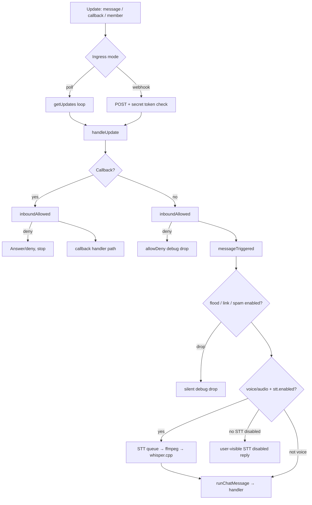
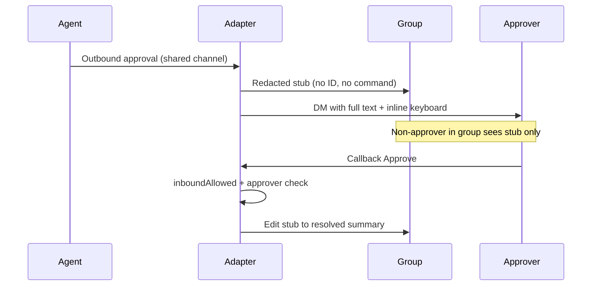

# feat: Telegram agent-complete parity upgrade

## Summary

Phased implementation plan to upgrade Heypi's Telegram adapter (and aligned chat adapters) from agent-focused long-poll integration to agent-complete parity: P0 security/formatting, P1 local voice STT and outbound/CLI improvements, P2 webhook ingress and opt-in group automation, P3 polls/location and examples. v1 ships when P0+P1 complete; P2/P3 are follow-on milestones in the same initiative.

## Problem frame

Heypi's Telegram adapter already leads on agent-native concerns (approvals, streaming, delivery retries, forum topics) but lacks classic bot surfaces: parse mode, callback allow enforcement, voice transcription, scheduled attachments, webhook mode, and group automation. Operators should not need a separate bot framework for voice notes, alert digests, or welcome flows.

The origin requirements doc defines P0–P3 scope, acceptance examples, and explicit non-goals (inline query, cloud STT, payments/games, TTS). This plan translates those requirements into dependency-ordered implementation units without re-litigating product scope.

---

## Requirements

Requirements trace to the origin doc. Grouped by delivery phase.

### P0 — correctness and security (v1 gate)

- R1. Callback and interactive-button handlers on Telegram, Slack, and Discord enforce the same `allow` dimensions as inbound messages; disallowed actors receive denial with no handler invocation or approval state change. Approval prompts in shared channels use a redacted group-visible stub plus DM full UI to approvers — no actionable approval IDs or pending command details in group messages. Full approval UI is DM-delivered to users in the intersection of `allow.users` and `approval.approvers` when `approval.approvers` is configured; when `approval.approvers` is unset, DM all users passing `inboundAllowed` for that chat (matching existing handler approver semantics). Group-resolved edits after approve/deny use redacted summaries only — never approval IDs, command details, or reasons in the group transcript.
- R2. Outbound Telegram messages support configurable parse mode (`MarkdownV2`, `HTML`, or plain) with safe escaping for approvals, agent markdown, and scheduler notifications.
- R3. Long-message chunking preserves valid markup boundaries or degrades per-chunk to plain text on send/edit failure.

### P1 — high user value (v1 gate)

- R4. Voice/audio is transcribed via local whisper.cpp without blocking the long-poll loop; transcription uses a bounded background queue.
- R5. STT is local-only (whisper.cpp + ffmpeg), TypeScript-orchestrated, with custom-command escape hatch, size/timeout safety, and AE4 graceful failure when prerequisites missing. STT is explicit opt-in via `stt.enabled`.
- R6. Photo-only inbound messages produce agent-visible context; photos flow through the attachment pipeline.
- R7. Outbound images use `sendPhoto`; non-images use document delivery.
- R8. Scheduled `adapter.send()` delivers attachments, not only text.
- R9. CLI adds `telegram setup-commands`.
- R10. CLI `telegram observe` prints chat ID, user ID, and copy-paste snippets for `allow.chats` and `allow.users`.

### P2 — product expansion (milestone)

- R11. Optional Telegram webhook ingress on the shared HTTP listener with `X-Telegram-Bot-Api-Secret-Token` validation; long-poll remains default; modes are mutually exclusive.
- R12. `Outbound` supports optional reply markup beyond built-in approval/progress buttons (Telegram delivery in v1; Slack/Discord send parity deferred per Scope boundaries).
- R13. Namespaced custom callback data routes to the agent with R1 allow enforcement (Telegram in v1; Slack/Discord deferred).
- R14. `my_chat_member` / `chat_member` updates optionally trigger welcome messages.
- R15. Per-user-per-chat flood control drops excess agent-triggering events (silent, debug log).
- R16. Optional link filtering drops messages with URLs outside an allowlist (silent, debug log).
- R17. Optional spam heuristics drop messages before agent invocation (silent, debug log).
- R18. Edited messages optionally re-process with configurable behavior (default: ignore).

### P3 — advanced parity (milestone)

Note: R19 is intentionally unused (origin removed inline query).

- R20. Poll creation via adapter config or agent tool wrapping `sendPoll`.
- R21. Location messages pass structured coordinates in inbound context.
- R22. Unsupported message types that would otherwise trigger the agent receive a concise user-visible reply (distinct from R15/R17 silent moderation drops).
- R23. New `examples/telegram-alerts` using Heypi HTTP webhook **input** adapter (not Telegram Bot API webhook).
- R24. Existing examples adopt relevant P1 features without changing product purpose.

### Documentation and operator experience (spanning)

- R25. Adapter docs cover new config, STT setup, webhook vs poll, group automation defaults, BotFather checklist.
- R26. STT and Telegram webhook env vars declared in root `.env.schema`.
- R27. Root `CHANGELOG.md` updated under `[Unreleased]` as capabilities land.

---

## Key technical decisions

| Decision | Rationale |
| --- | --- |
| **Shared `inboundAllowed()` helper in `gate.ts`** | R1 spans Telegram, Slack, Discord; one function normalizes actor + chat context for messages and callbacks (see origin R1, `packages/heypi/src/io/gate.ts`). |
| **Redacted group stub + DM full approval UI** | Satisfies AE1 without removing group-visible pending signal; mirrors Slack ephemeral / Discord ephemeral patterns adapted for Telegram DM delivery (user-confirmed default). |
| **STT explicit opt-in (`stt.enabled: false` default)** | Aligns with AE6 upgrade safety and group automation opt-in posture; avoids surprise host binary invocations on upgrade. |
| **STT queue wrapper with backpressure (`maxConcurrent: 2`, `maxPerChat: 1`, `maxPending` cap)** | Resolves D5; wraps existing `Queue` pattern (`packages/heypi/src/runtime/queue.ts`) with a bounded pending depth. Poll loop enqueues and returns immediately (R4). When pending cap exceeded → concise user-visible busy message, not silent drop or unbounded growth. |
| **Per-chunk plain-text fallback on parse errors** | R3: preserves maximum formatted content; avoids whole-message downgrade when one chunk fails Telegram markup validation. |
| **Silent debug-only moderation drops (D3)** | R15/R16/R17 drops do not notify moderators or end users; R22 handles user-visible unsupported-type replies only when the message would have reached the agent path. |
| **Gate order: allow → trigger → flood → link → spam → content-type/STT → agent** | Prevents R22 replies for messages already dropped by moderation; documented in code and adapter docs. |
| **Webhook startup fails hard if `setWebhook` fails** | Avoids silent "no ingress" state; operator must fix HTTPS/secret config before production webhook deploy. |
| **Single public `telegram()` API with internal modules** | Origin decision; split `stt/`, `telegram-format.ts`, `telegram-moderation.ts` without fragmenting developer surface. |
| **Phased PRs P0 → P1 → P2 → P3 (D4)** | P0 shared gate blocks downstream security work; P1 voice depends on non-blocking orchestration; P2/P3 parallelize where independent after P0 lands. |

---

## High-level technical design

### Adapter inbound pipeline (target state)



### Approval visibility in groups



### STT non-blocking model

Voice updates pass allow/trigger gates synchronously, then enqueue an STT job keyed by `update_id`. The poll loop continues processing other updates. On completion, the adapter injects transcribed text into the normal `runChatMessage` path. On failure (missing binary, timeout, oversize), send AE4 user message. Shutdown cancels in-flight jobs and cleans temp dirs.

---

## Output structure

New and split modules (expected layout after full initiative):

```text
packages/heypi/src/io/
  gate.ts                          # extend: inboundAllowed()
  telegram.ts                      # orchestration (slimmed over time)
  telegram-format.ts               # parse mode escape + markup chunking
  telegram-moderation.ts           # flood, link, spam (P2)
  telegram-webhook.ts              # webhook route + lifecycle (P2)
  stt/
    local-whisper.ts               # ffmpeg + whisper.cpp orchestration
    types.ts
  slack.ts                         # callback allow (P0)
  discord.ts                       # callback allow (P0)
packages/heypi/tests/
  gate-callback.test.ts            # cross-adapter allow matrix (P0)
  telegram-format.test.ts          # R2/R3 (P0)
  stt-local-whisper.test.ts        # R5 command builder + safety (P1)
  telegram-stt.test.ts             # non-blocking queue behavior (P1)
  telegram-webhook.test.ts         # R11 (P2)
  telegram-moderation.test.ts      # R15–R17, AE6 (P2)
examples/
  telegram-alerts/                 # R23 (P3)
```

---

## Implementation units

### U1. Cross-adapter callback allow enforcement

**Goal:** Enforce R1 allow dimensions on all interactive inbound paths before handler invocation.

**Requirements:** R1 (callback half)

**Dependencies:** None

**Files:**
- `packages/heypi/src/io/gate.ts` (add `inboundAllowed()` or equivalent exporting actor+chat normalization)
- `packages/heypi/src/io/telegram.ts` (`handleCallback`)
- `packages/heypi/src/io/slack.ts` (`handleAction`)
- `packages/heypi/src/io/discord.ts` (`handleInteraction`)
- `packages/heypi/tests/gate-callback.test.ts` (new)
- `packages/heypi/tests/adapter-filter.test.ts` (extend if needed)

**Approach:** Add adapter-specific wrappers reusing existing `telegramAllowed` / `slackAllowed` / `discordAllowed` (including Slack/Discord `groups` dimension). Pass `config.allow` into `handleCallback` / `handleAction` / `handleInteraction` (Telegram today omits allow on callback path). Call the wrapper at the top of each handler before `handler()`. On denial: Telegram `answerCallbackQuery` with clear text; Slack ephemeral/ack denial; Discord ephemeral reply; no handler call; approval store unchanged; log at debug. Preserve existing `approval.approvers` check inside handler as second layer after allow gate.

**Patterns to follow:** `allowByDimensions()` in `gate.ts`; `adapter-filter.test.ts` message allow matrix.

**Test scenarios:**
- Covers AE1 (callback half). Disallowed approver taps Approve on DM-delivered keyboard → callback answered with denial, handler mock not invoked, approval store unchanged.
- Group stub has no actionable callback buttons (separate assertion from denial path).
- Same matrix for Slack button action and Discord button interaction, including Slack/Discord `groups`-only allow configs.
- Allowlisted user passes gate; handler invoked (mock receives event).
- DM with `dms: false` → callback denied same as message path.

**Verification:** `pnpm --filter @hunvreus/heypi run test`; existing adapter-filter tests green.

---

### U2. Approval visibility redaction and parse mode foundation

**Goal:** Group-visible approvals leak no sensitive metadata (AE1 UI half); outbound supports configurable parse mode (R2).

**Requirements:** R1 (visibility), R2

**Dependencies:** U1

**Files:**
- `packages/heypi/src/io/telegram.ts` (approval send path, `telegramApprovalText`)
- `packages/heypi/src/io/slack.ts` (shared-channel approval redaction)
- `packages/heypi/src/io/discord.ts` (shared-channel approval redaction)
- `packages/heypi/src/core/approval-view.ts` (redacted vs full text builders)
- `packages/heypi/tests/telegram.test.ts`
- `packages/heypi/tests/approval.test.ts`

**Approach:** For non-DM chats, send redacted group message ("Approval pending — check DM") with empty or non-actionable markup. DM each approver per R1 recipient rules. On DM failure (403/blocked): log structured error, keep redacted group stub only, never fall back to full group markup; include non-sensitive deep-link hint in stub ("DM the bot with /start to receive approval prompts"). Group-resolved edits use redacted summary builders (actor + outcome only). Extend redaction to Slack/Discord shared-channel approval surfaces (ephemeral/redacted channel stub + approver-only full UI). Add `parseMode?: "MarkdownV2" | "HTML" | "plain"` to Telegram config; wire through `TelegramClient.sendMessage` / `editMessageText`. Add escape/sanitize helpers for MarkdownV2/HTML in new `telegram-format.ts` (HTML tag allowlist, block dangerous URL schemes; started here, chunking completed in U3).

**Patterns to follow:** Slack `approvalBlocks` ephemeral private path; Discord ephemeral followUp; `handler.ts` `out.private` handling.

**Test scenarios:**
- Covers AE1. Group pending approval payload contains no approval ID, no command details, no actionable buttons.
- Group-resolved edit after approve/deny contains no approval ID, command details, or reason text.
- Approver receives DM with full text and working Approve/Reject markup (mock API capture).
- Mocked DM 403 → group remains redacted stub only; structured error logged.
- Covers AE2. `parseMode: "MarkdownV2"` approval title escapes and sends with `parse_mode` set.
- Plain mode preserves literal asterisks (backward compatible default).

**Verification:** AE1 and AE2 oracles pass in unit tests; approval.test.ts still green.

---

### U3. Markup-safe message chunking

**Goal:** Long outbound messages respect Telegram markup boundaries (R3).

**Requirements:** R3

**Dependencies:** U2

**Files:**
- `packages/heypi/src/io/telegram-format.ts` (new)
- `packages/heypi/src/io/telegram.ts` (chunk send paths)
- `packages/heypi/tests/telegram-format.test.ts` (new)

**Approach:** Extend chunking beyond `chunkText` paragraph splits: track open markup spans; prefer breaks at paragraph/line boundaries inside valid markup; on `sendMessage`/`editMessageText` 400 parse errors, retry affected chunk as plain text. Pre-send HTML sanitizer: tag allowlist, escape dynamic strings, block `javascript:`/`data:` and non-http(s)/tg URL schemes in links before first API call. Apply to approval edits, agent replies, progress updates, and scheduled send.

**Patterns to follow:** Existing `telegramChunks` / 3800 limit; `chunkText` in shared utilities.

**Test scenarios:**
- 4000+ char MarkdownV2 message with bold spanning near boundary → all chunks valid or plain fallback, no throw.
- Code fence not split mid-fence.
- HTML injection fixtures: raw `<script>`, unbalanced tags, deceptive `<a href>` blocked or escaped before send.
- Plain mode chunking unchanged from current behavior.

**Verification:** R3 scenarios pass; existing telegram.test.ts chunk tests updated for parse mode paths.

---

### U4. Local STT module (whisper.cpp + ffmpeg)

**Goal:** TypeScript-only local transcription orchestration with safety constraints (R5 core).

**Requirements:** R5

**Dependencies:** None (parallel with U1–U3)

**Files:**
- `packages/heypi/src/io/stt/local-whisper.ts` (new)
- `packages/heypi/src/io/stt/types.ts` (new)
- `packages/heypi/tests/stt-local-whisper.test.ts` (new)
- `.env.schema` (STT env vars, R26 partial)
- `packages/heypi/src/config.ts` (STT config types)

**Approach:** Implement audio prep via `ffmpeg` execFile (OGG/Opus → 16 kHz mono WAV). Binary discovery: `HEYPI_LOCAL_STT_COMMAND` / `HERMES_LOCAL_STT_COMMAND` → `whisper-cpp` → `whisper-cli` in homebrew/local/PATH dirs. Custom command: parse template into argv array and invoke via `execFile` only — never `/bin/sh -c`. Reject templates with shell metacharacters or unknown placeholders. Fixed argv for default path; placeholder substitution with shell quoting on values only (no user/chat interpolation). Temp dir per job; 25 MB max; 300s timeout with process-tree kill. Return typed result `{ ok, text } | { ok: false, reason }` for AE4 messaging.

**Execution note:** Test command builder and safety limits with mocked `execFile` before integration.

**Patterns to follow:** `attachments.ts` execFile usage; `webhook.ts` timingSafeEqual discipline for secrets (not applicable to STT but same safety posture).

**Test scenarios:**
- Default argv construction with model path and WAV input.
- Custom command template substitutes only allowed placeholders; rejects/interpolates safely.
- Oversize file rejected before exec.
- Timeout kills process tree (mock timer + mock child).
- Missing binary/model returns structured failure reason for AE4 copy.

**Verification:** stt-local-whisper tests pass; no network or real binary required in CI.

---

### U5. Non-blocking voice integration and inbound/outbound media

**Goal:** Voice notes reach the agent via queued STT (R4); photo context, photo send, scheduled attachments (R6–R8).

**Requirements:** R4, R5 (integration), R6, R7, R8

**Dependencies:** U4; U3 recommended for outbound formatting

**Files:**
- `packages/heypi/src/io/telegram.ts` (voice/audio types, STT enqueue, photo-only text, sendPhoto, scheduled send)
- `packages/heypi/src/io/stt/local-whisper.ts`
- `packages/heypi/tests/telegram-stt.test.ts` (new)
- `packages/heypi/tests/telegram.test.ts`

**Approach:** Treat voice/audio/photo-only as trigger-eligible before `messageTriggered` (media bypass for mention-mode groups). Add `voice`/`audio` to update handling. When `stt.enabled` and gates pass, enqueue STT job on bounded STT queue wrapper (maxConcurrent 2, maxPerChat 1, maxPending cap). Poll loop returns immediately. Per-chat serialization: discard or cancel superseded STT jobs when newer user input arrives in the same chat before completion. When `stt.enabled` is false, voice/audio gets concise user-visible reply that STT is disabled (not empty-text agent invoke). On success, call existing message path with transcribed text + retained audio attachment. On STT module failure, send AE4 message. Photo-only: set synthetic inbound text ("Photo received" or configurable). Outbound: branch image attachments to `sendPhoto`. Scheduled `send()`: remove `scheduled_attachments_unsupported` warn path; deliver attachments with same photo/document rules.

**Test scenarios:**
- Covers AE3 (mocked execFile). Voice note → agent receives transcription text.
- Covers AE4. Missing whisper/ffmpeg/model → user-visible unavailable message, agent not invoked.
- Non-blocking: mock slow STT; callback update processed before STT completes.
- Voice then immediate text in same chat: superseded STT job discarded; only one agent turn.
- Queue full → user-visible busy message.
- Covers AE5. Scheduled send with image uses sendPhoto path (mock client).
- Photo-only inbound includes text context and attachment metadata.

**Verification:** AE3–AE5 oracles in tests; manual smoke doc in adapter docs for real whisper.cpp (R25 partial).

---

### U6. Telegram CLI extensions

**Goal:** BotFather command registration and richer observe output (R9, R10).

**Requirements:** R9, R10

**Dependencies:** U2 (parse mode docs alignment optional)

**Files:**
- `packages/heypi/src/cli.ts`
- `packages/heypi/tests/cli.test.ts` (extend or add telegram CLI tests)
- `packages/heypi/docs/adapters/telegram.md`

**Approach:** Add `telegram setup-commands` reading config file or built-in defaults; call `setMyCommands`. Extend `telegram observe` to print user ID and copy-paste YAML/JSON snippets for both `allow.chats` and `allow.users` (mirror Discord observe). Document that observe calls `deleteWebhook` and conflicts with webhook mode.

**Test scenarios:**
- setup-commands builds Bot API payload from config fixture.
- observe output includes chat and user snippets in stable format.
- setup-commands handles Bot API error response gracefully.

**Verification:** CLI tests pass; manual `telegram observe` spot check.

---

### U7. Telegram webhook ingress mode

**Goal:** Optional webhook deployment with secret token validation (R11).

**Requirements:** R11

**Dependencies:** U1 (shared handleUpdate path)

**Files:**
- `packages/heypi/src/io/telegram-webhook.ts` (new)
- `packages/heypi/src/io/telegram.ts` (mode switch, lifecycle)
- `packages/heypi/src/io/http.ts`
- `packages/heypi/tests/telegram-webhook.test.ts` (new)
- `.env.schema` (webhook secret vars, R26)

**Approach:** Config `mode: "poll" | "webhook"` (default poll). Require `start.http` registrar when mode is webhook; fail startup if missing. Webhook mode: register POST route on shared HTTP registry; validate `X-Telegram-Bot-Api-Secret-Token` with timing-safe compare (reuse `webhook.ts` length guard + `timingSafeEqual`); reject missing/wrong token before parsing body; cap request body size. Require cryptographically random secret (min 32 bytes) at startup when webhook enabled. Assemble `allowed_updates` (messages, callbacks, optional member/edited types) for both `setWebhook` and `getUpdates`. On `start`: call `setWebhook` with URL + secret + allowed_updates; do not start getUpdates loop. On `stop`: delete webhook. Poll mode: existing behavior + `deleteWebhook` on start + explicit allowed_updates. Fail startup if webhook registration fails when mode is webhook. Add short-TTL `update_id` dedupe in `handleUpdate` for restart safety.

**Patterns to follow:** `webhook.ts` authorized(); Slack signing secret fail-fast.

**Test scenarios:**
- Missing/wrong secret → 401, handler not called.
- Valid secret → update routed to same handleUpdate as poll.
- Lifecycle: webhook mode never calls getUpdates; poll mode deletes webhook on start.
- Concurrent poll+webhook prevented by mode config.

**Verification:** telegram-webhook tests pass; smoke checklist in docs for HTTPS reverse proxy.

---

### U8. Custom reply markup and namespaced callbacks

**Goal:** Agents and scheduler can send custom keyboards; custom callbacks route as structured inbound events (R12, R13).

**Requirements:** R12, R13

**Dependencies:** U1, U7 optional

**Files:**
- `packages/heypi/src/io/handler.ts` (Outbound type)
- `packages/heypi/src/io/telegram.ts` (send + callback parse)
- `packages/heypi/tests/telegram.test.ts`

**Approach:** Extend `Outbound` with optional `replyMarkup` serialized to Telegram inline keyboard JSON. Namespace all built-in callbacks (`heypi:approve:`, etc.) and reject agent-supplied `callback_data` matching reserved prefixes at serialization time. Custom callbacks use `heypi:` prefix only; enforce Telegram 64-byte limit via short-token indirection (registry/store mapping). Parse and route to handler as structured inbound event; apply U1 allow gate on actor.

**Test scenarios:**
- Outbound with custom markup appears in sendMessage payload.
- Custom callback with allowlisted user invokes handler with parsed payload.
- Disallowed user on custom callback → denial, no handler.
- Agent markup with `approve:fake-id` rejected at Outbound serialization.
- Oversize custom callback_data uses short-token indirection or rejects at send time.

**Verification:** Tests pass; cross-adapter note in docs if Slack/Discord markup deferred.

---

### U9. Group automation and edited messages

**Goal:** Opt-in welcome, flood, link, spam filtering; optional edited message handling (R14–R18, AE6).

**Requirements:** R14, R15, R16, R17, R18, AE6

**Dependencies:** U1; gate ordering documented

**Files:**
- `packages/heypi/src/io/telegram-moderation.ts` (new)
- `packages/heypi/src/io/telegram.ts`
- `packages/heypi/tests/telegram-moderation.test.ts` (new)
- `packages/heypi/docs/adapters/telegram.md`

**Approach:** Nested config defaults all off (`welcome: false`, `flood: false`, `linkFilter: false`, `spam: false`, `editedMessages: "ignore"`). R14: handle `my_chat_member` / `chat_member`, send template, no agent. R15: per-user-per-chat sliding window counter for agent-triggering events; excess → debug drop (default silent). Optional `groupAutomation.auditDrops: true` emits structured info-level drop events with rule id and actor (no message body) for operator visibility. R16: URL regex + allowlist. R17: repeated text / mention density heuristics (configurable thresholds). R18: `edited_message` updates when mode is `rerun` or `log`. Collapse R15–R17 config under `groupAutomation` namespace.

**Test scenarios:**
- Covers AE6. Empty config → no welcome/flood/link/spam behavior (fixture compares drop counts vs baseline).
- Flood enabled → N+1 rapid messages dropped silently, debug log asserted.
- Link filter drops URL message; no R22 reply.
- Welcome sends once on bot added event (mock).
- Edited message ignore mode → no handler call.

**Verification:** AE6 oracle; moderation tests pass.

---

### U10. Polls, location, unsupported types, and examples

**Goal:** P3 parity surfaces and example adoption (R20–R24).

**Requirements:** R20, R21, R22, R23, R24

**Dependencies:** U8 for tool patterns; U3 for outbound formatting

**Files:**
- `packages/heypi/src/io/telegram.ts`
- `examples/telegram-alerts/` (new)
- `examples/telegram-workout/` (parse mode, commands)
- `examples/telegram-cofounder/` (relevant P1 adoption)
- `examples/AGENTS.md`
- `packages/heypi/tests/telegram.test.ts`

**Approach:** R20: config or agent tool wrapping `sendPoll`. R21: parse `location` into inbound structured fields. R22: after gates, if message would trigger agent but content unsupported (sticker-only, empty), send concise reply — not applied to moderation drops. R23: new example wiring Heypi `webhook()` input → scheduler → Telegram `send()` (distinct from R11). R24: update examples for parse mode, voice where appropriate, setup-commands docs.

**Test scenarios:**
- Location inbound includes lat/long in normalized event.
- Sticker-only in DM (would trigger) → R22 reply sent.
- Sticker in group without mention → silent trigger fail, no R22.
- Poll tool/config produces valid sendPoll payload (mock).

**Verification:** Example README runnable steps; `pnpm run test:telegram:cofounder` still passes after cofounder touch.

---

### U11. Documentation, env schema, and changelog

**Goal:** Operator docs and governance artifacts stay aligned with shipped units (R25–R27).

**Requirements:** R25, R26, R27

**Dependencies:** Each phase's behavior (incremental doc commits preferred)

**Files:**
- `packages/heypi/docs/adapters/telegram.md`
- `.env.schema`
- `CHANGELOG.md`
- `packages/heypi/docs/adapters/index.md` (cross-adapter callback allow note)

**Approach:** Document all new config keys, STT host prerequisites (ffmpeg, whisper-cpp, ggml model), webhook vs poll deployment, group automation BotFather prerequisites, gate order, AE4 setup, and moderation blind-spot (silent drops default). Declare `HEYPI_STT_MODEL_PATH`, `HEYPI_LOCAL_STT_COMMAND`, Telegram webhook secret token env vars when read by adapter. **R26 trace:** STT vars verified at U4 merge (`varlock audit`); webhook vars at U7 merge; U11 final cross-check all declared vars match config reads. Append `[Unreleased]` changelog entries per merged phase.

**Test scenarios:**
- Test expectation: none — documentation unit; verify `varlock audit` passes after `.env.schema` changes.

**Verification:** `varlock audit`; docs match implemented config types.

---

## Scope boundaries

### Initiative scope (P0–P3)

- Full P0–P3 requirements from origin doc, phased delivery.
- Cross-adapter R1 callback allow and approval visibility on Telegram, Slack, Discord.
- Local-only whisper.cpp STT; explicit opt-in.

### v1 ship gate (P0+P1 only)

- Units U1–U6 plus per-unit doc/env deltas (see Phased delivery checklist).
- Does not require P2 webhook, group automation, or P3 polls/examples.

### Deferred to follow-up work

- Slack/Discord custom reply markup parity beyond Telegram (unless trivial extension during U8).
- Moderator notifications on spam/flood drops (D3 deferred; silent debug-only for v1).
- In-process `@huggingface/transformers` STT.
- Docker/runtime image shipping whisper.cpp by default.

### Deferred for later (from origin — not this initiative)

- Inline query mode; cloud STT; Telegram payments/games; TTS; n8n-style workflows; automatic BotFather profile editing beyond commands CLI.

### Outside this product's identity (from origin)

- Standalone hosted notification SaaS; Python ML STT stacks; replacing agent model with fixed command handlers.

---

## Phased delivery

| Phase | Units | Success gate |
| --- | --- | --- |
| **v1 (P0+P1)** | U1–U6, U11 partial | Origin "Initiative complete (v1)" criteria; AE1–AE5; `pnpm run check`, `typecheck`, `@hunvreus/heypi` test. **U11 v1 minimum:** `telegram.md` sections for P0/P1 config + STT prerequisites; `.env.schema` STT vars from U4; cross-adapter callback note in `adapters/index.md`; `[Unreleased]` entries for U1–U6 capabilities |
| **P2 milestone** | U7–U9, U11 partial | R11–R18; AE6; webhook smoke |
| **P3 milestone** | U10, U11 final | R20–R24; examples runnable |

PR slicing follows units where possible: U1+U2 can land together as P0 security; U3 as P0 formatting; U4+U5 as P1 voice; U6 as P1 CLI; U10 expected as 2–3 PRs (core parity, alerts example, example adoption). Each unit PR includes its doc/env delta per origin v1 rule.

---

## Risks and dependencies

| Risk | Mitigation |
| --- | --- |
| Cross-adapter R1 regression | Shared helper + gate-callback.test.ts matrix before merge |
| STT blocks poll loop | Queue with explicit non-blocking contract test (U5) |
| MarkdownV2 escape bugs | Per-chunk plain fallback; focused telegram-format tests |
| Webhook/poll double ingress | Mode enum + lifecycle tests; docs warn observe deletes webhook |
| Group automation behavior change on upgrade | All automation off by default; AE6 fixture test |
| Host STT prerequisites missing in Docker | Document AE4; no false promise in runtime images |
| R23 vs R11 confusion | Example uses Heypi webhook input adapter; distinct env vars and docs |

**Host prerequisites (operators):** ffmpeg, whisper-cpp/whisper-cli, ggml model file; HTTPS for webhook mode.

---

## Open questions

All origin blockers resolved or decided in this plan:

- D3 → silent debug-only drops (moderator notify deferred).
- D4 → P0 → P1 → P2 → P3 PR order with unit mapping above.
- D5 → `Queue`-based STT with maxConcurrent 2, maxPerChat 1.

**Deferred to implementation (non-blocking):**

- Exact MarkdownV2 escape edge cases for nested entities (discover via Telegram API errors + tests).
- Forum topic flood buckets: document whether `message_thread_id` splits R15 windows (default: per-chat, threads share bucket unless config adds thread dimension).
- Progress/cancel button visibility in shared channels: document which interactive surfaces remain group-visible vs DM-only (sensitive IDs already namespaced under `heypi:`).

---

## Sources and research

- Origin: `docs/brainstorms/2026-06-07-telegram-full-parity-requirements.md`
- Current adapter: `packages/heypi/src/io/telegram.ts`
- Allow gates: `packages/heypi/src/io/gate.ts`
- Webhook secret pattern: `packages/heypi/src/io/webhook.ts`
- Runtime queue: `packages/heypi/src/runtime/queue.ts`
- Subprocess precedent: `packages/heypi/src/io/attachments.ts`
- Prior cofounder plan: `docs/plans/2026-06-06-001-feat-telegram-cofounder-example-plan.md`
- Repo research and flow analysis (2026-06-07 planning session)
